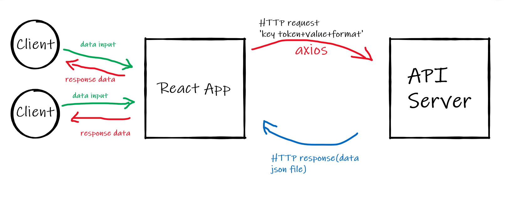

# [City Explorer](https://610bba0d47fe6cc73b49c564--city-exploror-rahaf.netlify.app/)

**Author**: Rahaf Al-Jazzazi

**Version**: 1.0.4

## Overview
<!-- Provide a high level overview of what this application is and why you are building it, beyond the fact that it's an assignment for this class. (i.e. What's your problem domain?) -->

## Getting Started
<!-- What are the steps that a user must take in order to build this app on their own machine and get it running? -->

## Credit and Collaborations
<!-- Give credit (and a link) to other people or resources that helped you build this application. -->

## Time Estimates

### Name of feature:
Fetures that I used in the lab Forms, arrow functions, axios and try&catch.

### Estimate of time needed to complete:
4 hours

### Start time: 
13:00
### Finish time: 
20:00 
### Actual time needed to complete:
04 hours